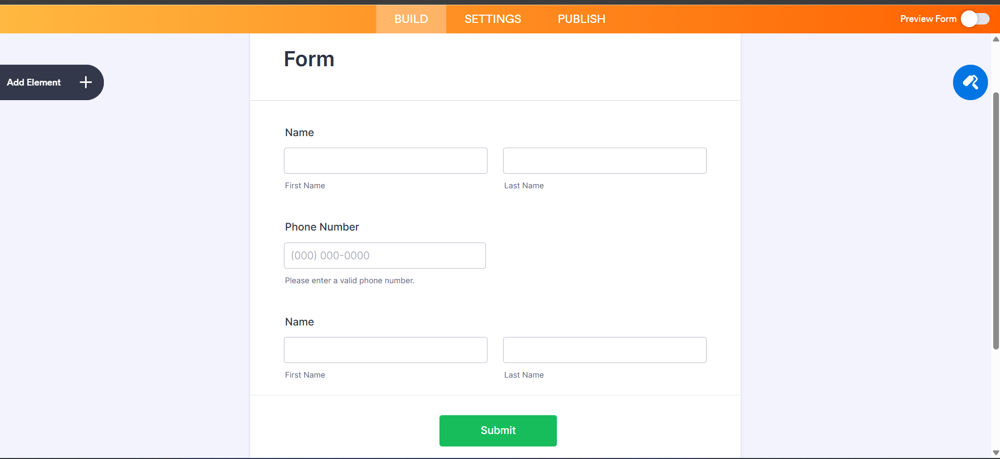

# Application integrates Jotform with Bitrix24 CRM
## 1. Introduction
This application integrates Jotform with Bitrix24 CRM:
- Users fill out a Jotform (Name, Phone, Email).
- When the form is submitted, the data is sent to this application via a webhook.
- The application calls the Bitrix24 API to create a new Contact.
- All activities are logged (data received, successful submission, or error).

## 2. System Requirements

- Node.js >= 18 (LTS recommended)

- npm or yarn package manager

- Jotform account

- Bitrix24 account (cloud or self-hosted)

- Ngnok 

## 3 Jotform setup 

### 3.1 Log in to Jotform

### 3.2 Create a new form with the following fields:

- Name (Short Text)

- Phone Number (Phone)

- Email (Email)



### 3.3 Add webhook to Form
1. Go to your form **Settings** → **Integrations** → **Webhooks**.
2. Add the webhook URL. If using ngrok, it will look like:
```
https://dcf929e61a19.ngrok-free.app/webhook-jotform
```
3. Save the integration.

## 4. Server Setup

### 4.1 Clone repository & install dependencies
```bash
git clone <repo-url>
cd <repo-folder>
npm install
```

### 4.2 Environment Variables
Create a .env file in the root directory:

```
PORT=3000
BITRIX_INBOUND_WEBHOOK_URL=https://b24-xxxx.bitrix24.vn/rest/1/your-webhook-key/

```

### 4.3 Start Server

```
node index.js
```
Server will start at:
```
http://localhost:3000
```

## 5. Expose Local Server with Ngrok

Since Jotform requires a **public HTTPS URL** to send form submissions, we use **Ngrok** to expose our local server (http://localhost:3000) to the internet.

### 5.1 Download & Install Ngrok

- Download Ngrok from the official website:
  - [Windows](https://ngrok.com/downloads/windows?tab=download)  
  - [macOS](https://ngrok.com/downloads/mac)  
  - [Linux](https://ngrok.com/downloads/linux)  

- Unzip the downloaded file and place the `ngrok` executable in a directory.  
  Example for Windows: `C:\ngrok\ngrok.exe`

- (Optional) Add the Ngrok folder to your **PATH** environment variable for easier access.

### 5.2 Connect Ngrok to Your Account
1. Create a free account on [ngrok.com](https://ngrok.com/).  
2. Copy your **AuthToken** from the Ngrok dashboard.  
3. Run the following command to connect your account:

```bash
ngrok config add-authtoken <your-authtoken>
```
### 5.3 Run Ngrok

In your project root (where the server is running on port 3000), open a new terminal and run:

```
ngrok http 3000
```

You will see output like:

```
Forwarding    https://dcf929e61a19.ngrok-free.app -> http://localhost:3000
```
The generated https://xxxx.ngrok-free.app is your public URL

### 5.4 Use Ngrok URL in Jotform Webhook

Copy the Ngrok forwarding URL and paste it into your Jotform webhook integration in 3.3 step
```
https://dcf929e61a19.ngrok-free.app/webhook-jotform
```
The part https://dcf929e61a19.ngrok-free.app is the public domain generated by Ngrok.

The part /webhook-jotform is the route of your Express server that receives data from Jotform.
Now, every time a form is submitted in Jotform, the data will be sent to your local server through Ngrok.


### 6. Setup Bitrix24 Inbound Webhook

To send data from your server into Bitrix24, you need an **Inbound Webhook URL**.  
This URL acts as a "key" that allows your app to call Bitrix24 REST API without OAuth.

### 6.1 Log in to Bitrix24
- Go to your Bitrix24 portal:  
### 6.2 Go to Webhook Settings
1. Click Applications -> Developer resources -> other -> Inbound webhook -> generate -> copy webhook url

### 6.2 Copy Webhook URL
After saving, Bitrix24 will generate a webhook URL similar to:

```
https://b24-xxxxx.bitrix24.vn/rest/1/173ff493skw/
```
This URL already contains:
- Your Bitrix24 portal ID (`b24-xxxxx`).
- The REST user ID (`1`).
- A secret key (`173ff493skw`).

### 6.3 Add to .env
Open your `.env` file and add:
```
BITRIX_INBOUND_WEBHOOK_URL=https://b24-xxxxx.bitrix24.vn/rest/1/173ff493skw/
```
